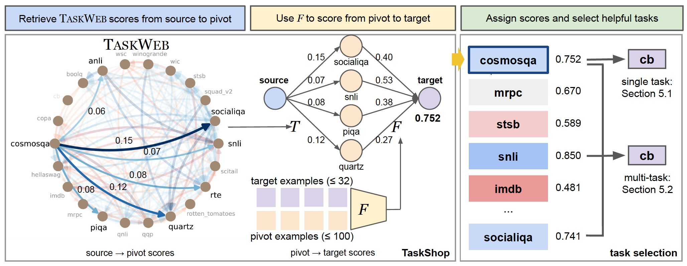

# TaskWeb
This is the original implementation of [TaskWeb: Selecting Better Source Tasks for Multi-task NLP](https://arxiv.org/abs/2305.13256) by [Joongwon Kim](https://danieljkim0118.github.io/), [Akari Asai](https://akariasai.github.io/), [Gabriel Ilharco](http://gabrielilharco.com/) and [Hannaneh Hajishirzi](https://homes.cs.washington.edu/~hannaneh/).

<!--  -->

<p align="center">
    
</p>

<p align="center" style="font-size: 100%">
    <b><em>Our project page is available <a href="https://danieljkim0118.github.io/taskweb_nlp/">here</a>!</em></b>
</p>

## Content

1. [Installation](#installation)
2. [TaskWeb](#data)
3. [TaskShop](#taskshop)
4. [Single-Task Selection](#single-task)
5. [Multi-Task Selection](#multi-task)

## Installation

Perform the following installation to run all code associated with this repository. We use Python 3.8.13 for our code. Create a new conda environment with the specific Python version and install the libraries specified in the 

```
conda create -n <ENV_NAME> python=3.8.13
conda activate <ENV_NAME>
pip install -r requirements.txt
```

## TaskWeb
TaskWeb, our repository of pairwise task transfer across 22 different tasks in seven different adaptation settings, is available in the `data/taskweb` subdirectory. The `taskweb.p` file contains the processed TaskWeb results and the `data/taskweb/results` subdirectory contains the original performances of models transfered via `source⭢target`. Note that each subdirectory is formatted as `<TARGET_TASK>/<SOURCE_TASK>/<MODEL_ID>-e<EPOCHS>-lr<LEARNING_RATE>-b<BATCH_SIZE>-s<SEED>`.

## TaskShop
We provide implementations of TaskShop as well as our baselines: LLM-similarity ([Paranjape et al., 2023](https://arxiv.org/abs/2303.09014)) and Retrieval-of-Experts (RoE, [Jang et al., 2023](https://arxiv.org/abs/2302.03202)). Note that our pre-computed scores have been provided, so continue to [Single-Task Selection](#single-task) if needed.

Run the following code to obtain task transferability predictions for TaskShop for all tasks used in our experiments. Use `roe` to use Retrieval-of-Experts and `llm` to use LLM-similarity as the backbone task selection module. Omit the `target_num` argument when using `llm`.
```
cd taskshop
python taskshop_predict.py --task_selection roe --model_id all-MiniLM-L6-v2 --target_num 32
```

Similarly, run the following code to obtain task transferability predictions for LLM-similarity and Retrieval-of-Experts, respectively.
```
python llm_predict.py --model_id text-davinci003 --openai_api_key <OPENAI_API_KEY>
python roe_predict.py --model_id all-MiniLM-L6-v2 --source_num 100 --target_num 32
```

Note that we use `text-davinci-003` as our model for the LLM-similarity method, and `all-MiniLM-L6-v2` for the Retrieval-of-Experts method. For Retrieval-of-Experts we use 100 examples of the source task and 32 examples of the target task.

Having obtained score predictions between pairs of tasks using the task selection methods above (LLM-similarity, Retrieval-of-Experts, TaskShop), we now apply them to two settings: selecting 1) a single helpful task for each target and 2) multiple helpful tasks for multi-task learning.

## Single-Task Selection
Run the following codes to evaluate the NDCG (normalized discounted cumulative gain) and Regret @ 5 for selecting single helpful tasks as reported in our paper.

LLM-Similarity
```
python llm_evaluate.py --model_id text-davinci-003
```

Retrieval-of-Experts
```
python roe_evaluate.py --model_id all-MiniLM-L6-v2 --target_num 32
```

TaskShop
```
python taskshop_evaluate.py --task_selection roe --model_id all-MiniLM-L6-v2 --target_num 32
```

Again, use `roe` to use Retrieval-of-Experts and `llm` to use LLM-similarity as the backbone task selection module. Omit the `target_num` argument when using `llm`.

## Multi-Task Selection
Before proceeding, note that we provide the training and evaluation results for our multi-task training experiments - skip the following two scripts (`train.sh` and `eval.sh`) if needed. The complete list of our multi-task training set descriptions are provided in `multitask/multitask_info.py`.

To perform multi-task finetuning with our training sets, use the following command which assumes that `slurm` is installed as well as GPUs of $\geq$ 64G memory. (We use a single NVIDIA A100 for each of our experiments.)
```
sbatch train.sh
```

Make sure to modify the contents inside the file such as the output directory, cache directory, etc.

Perform evaluation with the following script.
```
sbatch eval.sh
```

Again, check that the output and cache directories are set correctly.

Finally, run the following the code to obtain the post-processed experiment results in Table 3 of the paper.
```
python run_eval.py
```

Run the following code to obtain results reported in Table 4 of the paper (changing the number of tasks in the multi-task training set).
```
python run_eval_size.py
```

Run the following code to obtain results reported in Figure 4 of the paper (changing the mixture of helpful and unhelpful source tasks for each target).
```
python run_eval_mix.py
```
